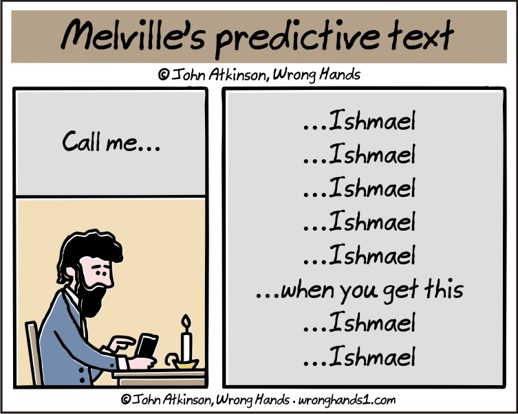
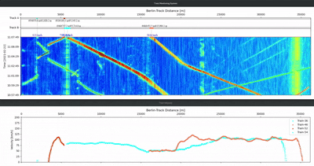

# Edge Inference Intro



## Pre-reading

Situnayake and Plunkett's [*AI at the Edge*, Chapter 1](https://learning.oreilly.com/library/view/ai-at-the/9781098120191/ch01.html),
in particular, the text surrounding:

- Figure 1-3
- Figure 1-7
- BLERP (Bandwidth, Latency, Economics, Reliability, Privacy)

## Opening: A Use Case

<iframe width="560" height="315" src="https://www.youtube.com/embed/ehY2zxDILwQ?si=Qii6IpfL_uA1w_bZ" title="YouTube video player" frameborder="0" allow="accelerometer; autoplay; clipboard-write; encrypted-media; gyroscope; picture-in-picture; web-share" referrerpolicy="strict-origin-when-cross-origin" allowfullscreen></iframe>

From the [DTS N45 Flyer](https://www.apsensing.com/fileadmin/landingpages/dtsn45series/downloads/Flyer_DTS_N45-Series.pdf)

> - Range of up to 70km.
> - Designed to operate everywhere - from the desert to the arctic... allows deployment in hazardous areas (EX-Zones).
> - Cyber Security: VxWorks – the Real-Time Operating System used in mission critical applications, e.g. the aerospace industry.
> - Modern, easy to use web interface to set up and configure the system.
> - A lifetime MTBF. All instruments are "designed & made in Germany."

[AP Sensing: Railway Monitoring](https://www.apsensing.com/application/rail-monitoring/)

> In conjunction with a track-side fiber optic cable infrastructure, AP Sensing's **Distributed Acoustic Sensing (DAS**) system can detect and supply information about the exact position, speed and direction of moving trains in the network in real time.
>
> It enables preventive and predictive maintenance, minimizing unscheduled service disruptions. Our DAS system also increases safety by assuring train integrity and detecting people or falling objects on the tracks. Intrusion, vandalism and cable theft are detected and precisely located with the AP Sensing DAS.
>
> Our **Distributed Temperature Sensing (DTS**) offers continuous temperature monitoring along the entire fiber optic cable, e.g. along cable ducts. This enables heat/fire detection and location within cable ducts and cable trays, and inside train and metro stations. Systems are completely certified for fire detection (VdS, UL, FM, IECEx, SIL).



- Why are these devices distributed?
- How many of these devices do you need to monitor the ~1100km between Berlin and Paris?
- How much processing is done on each device vs. on the cloud?

## What's the "Edge"???

> Edge devices are our link between the internet and the physical world ~ *AI at the Edge*

```{figure} ../img/cloud_to_edge-ai-at-edge.png
Figure 1-3. Devices at the edge of the network can communicate with the cloud, with edge infrastructure, and with each other; edge applications generally span multiple locations within this map (for example, data might be sent from a sensor-equipped IoT device to a local edge server for processing) ~ *AI at the Edge*
```

Cloud vs. Edge is part of the tradeoff between **throughput** and **latency**.

Cloud-based servers can throughput massive amounts of computation, but this can take time!.
Meanwhile, edge devices can have extremely low latency, but they cannot perform very many calculations!

```{figure} ../img/robot-shower.jpg
**Throughput** is how much water the shower can put out;
**Latency** is how long it takes the water to change temperature after adjusting the handle.

Image generation requires lots of throughput and is not particularly sensitive to latency, so should be done in the cloud.
```

Because of the constraints of - and challenges of working with - edge devices, we may do **inference at the edge** but will almost always **train in the cloud.**

### Characteristics of Edge Devices

1. Embedded within a system; often application specific
2. Coupled with sensors
3. Tightly constrained
    - Power
    - Size
    - Compute

### Our Edge Device

For this class we will use the Arduino [Nano 33 BLE Sense Rev2 (User Manual)](https://docs.arduino.cc/tutorials/nano-33-ble-sense-rev2/cheat-sheet/)


Nano 33 uses the **nRF52840** chip, which has 1MB of flash ROM and a whopping 256 KB SRAM!

## When to use Edge AI

### BLERP

Introduced by Jeff Bier in [What's Driving AI and Vision to the Edge](https://www.eetasia.com/whats-driving-ai-and-vision-to-the-edge/),
reformatted in [*AI at the Edge*, Chapter 1](https://learning.oreilly.com/library/view/ai-at-the/9781098120191/ch01.html#:-:text=To%20Understand%20the%20Benefits%20of%20Edge%20AI%2C%20Just%20BLERP)
it is *a filter to decide whether edge AI is well-suited for a particular application.*

- **Bandwidth** limitations (speed and power) prevent uploading the data.
- **Latency** requirements are too tight to transmit and process data and process elsewhere.
- **Economics** expect that it will be too expensive to connect to a central server.
- **Reliability** of safety-critical applications demands function without connectivity.
- **Privacy** benefits of keeping data local are worth it.

### Other Criteria

> The decision of whether to use ML is a question of both “Is it good enough?” and “Can we handle the types of errors it is likely to make?” ~ *AI at the Edge*

Here is Situnayake's suggested checklist:

- There is no existing rule-based solution, and you don’t have the resources to discover one.
- You have access to a high quality dataset or collecting one is within your budget.
- Your system can be designed to make use of fuzzy, probabilistic predictions.
- You do not need to explain the exact logic behind your system’s decisions.
- Your system will not be exposed to inputs beyond those reflected in its training data.
- Your application can tolerate a degree of uncertainty.

### Examples

Firefighter wearable sensor


Mars Rover


### BLERP Analysis

From [*AI at the Edge*, Chapter 6: Understanding and Framing Problems](https://learning.oreilly.com/library/view/ai-at-the/9781098120191/ch06.html#:-:text=Describing%20a%20Problem)

> Summary: Wildlife researchers sometimes need to estimate animal population and activity in remote areas.
> One way of doing this is to install trail cameras in remote locations to monitor specific animal species.
> The devices typically use a passive infrared (PIR) motion sensor to detect motion, triggering a camera to take a photograph.
> Photographs are saved to a memory card. The memory card is collected periodically to obtain the photos, which are then analyzed by researchers.
>
> **Problems:**
>
> - The PIR can be triggered by nontarget species or moving vegetation, filling up the memory card with useless photos and reducing battery life.
> - No animal activity data is available until the memory card has been collected and analyzed.
> - It’s time consuming and expensive to send somebody to collect a memory card from a remote location.
> - If the memory card is collected too infrequently, it will fill up and important data will be missed.
> - If the memory card is collected too frequently, then money is being wasted on travel expenses.
>
> **Constraints:**
>
> - Trail cameras run on battery power and must be energy efficient.
> - High-bandwidth data connections are expensive in the field.
> - Research budgets are typically low.

*Should we deploy to the edge? Use BLERP!*
