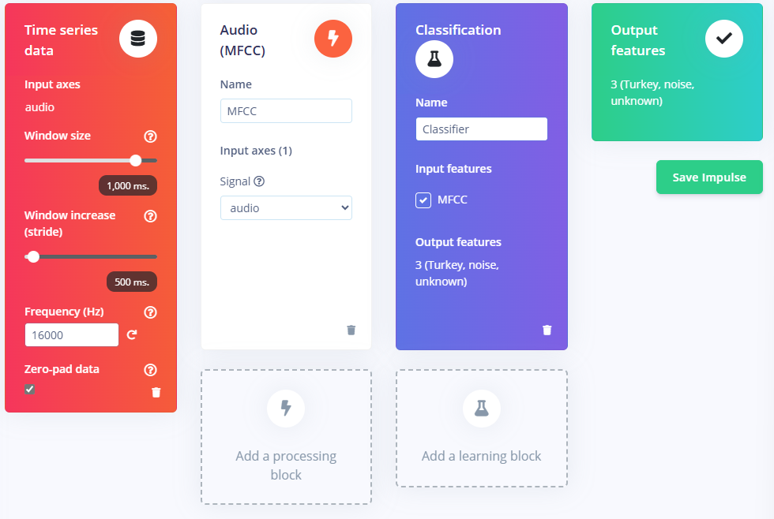

# Lab 3: Edge Impulse KWS

In this lab we will make a "Hey, Siri" type device that continuously listens for a keyword.
When your device spots your keyword it will turn on an LED!

## Prelab

### Reading

For Iodice's [*TinyML Cookbook, 2nd Ed*, Chapter 4: "Using Edge Impulse and the Arduino Nano to Control LEDs with Voice Commands"](https://learning.oreilly.com/library/view/tinyml-cookbook/9781837637362/Text/Chapter_04.xhtml):

Here is the chapter Summary... first.

> The recipes presented in this chapter demonstrated how to build an end-to-end KWS application with Edge Impulse and the Arduino Nano.
>
> Initially, we learned how to prepare the dataset by recording audio samples with a smartphone and the Arduino Nano directly from Edge Impulse.
>
> Afterward, we delved into model design. Here, we introduced the MFE (or Mel-spectrogram) as a suitable input feature for training a CNN model for KWS.
>
> Then, we trained a generic CNN and used the Edge Impulse EON Tuner to discover more efficient model architectures for our target platform regarding accuracy, latency performance, and memory consumption.
>
> Finally, we tested the model’s accuracy on the test dataset and live audio samples recorded with a smartphone and deployed the KWS application on the Arduino Nano.
>
>In this chapter, we have started discussing how to build a tinyML application with a microphone using Edge Impulse and the Arduino Nano. With the next project, we will continue this discussion on the Raspberry Pi Pico to recognize music genres with the help of TensorFlow and the CMSIS-DSP library.

You need to read the following excerpts:

- *Read* the intro, up through the "Technical Requirements"
- *Skim* "Acquiring audio data with a smartphone" and "Acquiring audio data with the Arduino Nano"
- *Read* [Extracting MFE features from audio samples](https://learning.oreilly.com/library/view/tinyml-cookbook/9781837637362/Text/Chapter_04.xhtml#:-:text=Extracting%20MFE%20features%20from%20audio%20samples) up to but not including "How to do it..."
- *Read* [Designing and training a CNN](https://learning.oreilly.com/library/view/tinyml-cookbook/9781837637362/Text/Chapter_04.xhtml#:-:text=Designing%20and%20training%20a%20CNN) up to but not including "Step 3."
- *Read* [Keyword spotting on the Arduino Nano](https://learning.oreilly.com/library/view/tinyml-cookbook/9781837637362/Text/Chapter_04.xhtml#:-:text=Keyword%20spotting%20on%20the%20Arduino%20Nano) through "Step 1", then *skim* the rest.

*Yes, you have to read them.*

### Data Collection

> Collecting a dataset is typically the most difficult, time-consuming, and expensive part of any edge AI project. It’s also the most likely place you will make terrible, hard-to-detect mistakes that can doom your project to failure. ~ [*AI at the Edge*](https://learning.oreilly.com/library/view/ai-at-the/9781098120191/ch07.html#:-:text=Collecting%20a%20dataset,project%20to%20failure.)

You need to think of a great keyword! It should be at least two syllabus, three ideally.
Examples (that you can't use) include 'Hey Siri', 'OK, Google', 'Alexa', 'Hello World'.

Once you think of your awesome keyword:

1. Create an [Edge Impulse](https://edgeimpulse.com/) account; I used my afacademy email.
2. Login, then **Create a new project** (top right of [projects page](https://studio.edgeimpulse.com/studio/profile/projects)). You can name it `kws_lab` or whatever you want.
3. Click **Data acquisition** in the left sidebar.
4. In the *Collect data** box, click the chip symbol in the top right; hovering says "connect a development board"
5. Scan the QR code to connect your phone.
6. Change the label to "keyword" or something helpful
7. Record 10 seconds of you saying your keyword in spaced intervals.

```{hint}
The Reading ^^ that you *definitely* did goes into detail for [collecting audio samples for KWS](https://learning.oreilly.com/library/view/tinyml-cookbook/9781837637362/Text/Chapter_04.xhtml#:-:text=Collecting%20audio%20samples%20for%20KWS).
```

Go back to your dashboard and make sure the samples look good. Once they do...

**Copy the QR Code** or **grab URL from the QR code**. Mine started with `https://smartphone.edgeimpulse.com/index.html?apiKey=` and had a 67-character API key.

Then...

**Share** with your friends and family!

Be sure to give them *very specific instructions** on how to record themselves saying your keyword.
Your goal is to get lots of different people saying your keyword so that you have a robust dataset.

Ideally, you have several minutes of audio prior to the lab starting... best of luck!

### Equipment Setup

Strictly speaking, you can wait to do equipment setup until during the lab...
up to you to decide which type of risk you want to accept, commander!

On your **Raspberry Pi** we will install edge-impulse-cli and arduino-cli.

Before doing anything, let's update the installed software.

```bash
sudo apt update && sudo apt upgrade -y
```

#### Edge Impulse CLI

Now do the relevant portions from the [Linux installation docs](https://docs.edgeimpulse.com/docs/tools/edge-impulse-cli/cli-installation#installation-linux-ubuntu-macos-and-raspbian-os).

Specifically,

- Install node
- Verify node version and path
- Install `edge-impulse-cli`

After installing you need to `exit` that terminal and open a new one.

Then verify it installed:

```bash
edge-impulse-daemon --version
```

#### Arduino CLI

Install `arduino-cli` according to [the docs](https://arduino.github.io/arduino-cli/1.1/installation/)

First, ensure `~/.local/bin` is on your PATH.

The environment variable `$PATH` is a list of directories that the OS will search for executables, *in order.*

```bash
# This shows your home directory, which uses the ~ symbol for short
# We expect it to be /home/pi/ by default, but it can be whatever!
echo $HOME

# This will print your current path.
# We expect to see ~/.local/bin/ towards the end,
# but instead of ~ it will be the result from the previous command
echo $PATH
```

We want to install the Arduino CLI to somewhere on our path. If we do `~/.local/bin` we don't need `sudo`.

```bash
curl -fsSL https://raw.githubusercontent.com/arduino/arduino-cli/master/install.sh | BINDIR=~/.local/bin sh
```

Verify installation

```bash
arduino-cli version
```

#### Dialout Group

Lastly, we need to add your user to the Linux dialout group.

```{note}
It took Capt Yarbrough two entire afternoons to figure out that this needs to be done 🫠
```

The dialout group grants users permissions to access serial ports and modems.
Our Arduino board and daemon will connect to the serial port in such a way that we'll need this.

```bash
sudo usermod -aG dialout $USER
```

Then reboot.

```bash
sudo reboot
```

Once logged back in, user `pi` (or whoever you are) should be in dialout group.

```bash
grep dialout /etc/group
```

### Arduino Firmware

Follow the instructions to [connect edge impulse to the Arduino Nano 33 BLE Sense](https://docs.edgeimpulse.com/docs/edge-ai-hardware/mcu/arduino-nano-33-ble-sense#id-1.-connect-the-development-board-to-your-computer).

Specifically, you need to **connect the board** and **update firmware.**
You don't strictly need to do the "setting keys" part, but it might be helpful.


If successful you should see a message like

> Flashed your Arduino Nano 33 BLE development board.

```{tip}
You *can* do all of this on Raspberry Pi or you *can* do all of this on Windows.
But I've found that:

1. Installing node and these things on Windows is a bad idea.
2. Folks like to be able to take their board and laptop out of the lab and still do work.
```

---

# Lab Workday

## Data Processing

At this point hopefully your friends and family have uploaded lots of samples of your **keyword** to your Edge Impulse project!

These samples were recorded on a phone microphone. However, we are going to be using our Arduino for real-world inference. As such, we will record some samples with the Nano's builtin microphone.

Once we do that, we'll need to process all this data so that it's ready to use!

### Collect Samples with Nano

> Building the dataset with recordings obtained with the mobile phone’s microphone is undoubtedly good enough for many applications. However, to prevent any potential loss in accuracy during the model’s deployment, we should also include audio clips recorded with the microphone used by the end application in the dataset. ~ *TinyML Cookbook*

To get started, you can connect your Arduino - with the Edge Impulse firmware already flashed - to your EdgeImpulse.com online project.

You can do this on your laptop, Pi, whatever; you *must* use Edge or Chrome.

1. Connect your Arduino to laptop with USB
2. Open your online project
3. Click on **Data acquisition** in the left sidebar
4. In the Collect data box, click the USB symbol in the top right.
5. Your browser will open a popup, select Nano 33.


**Record about 50 samples of yourself saying the keyword, using your Nano microphone.**

### Split Samples

And now, for the fun, grueling, reality of machine learning: data processing!

Follow the guidance in *TinyML* combined with [Edge Impulse Tutorial: Responding to your voice](https://docs.edgeimpulse.com/docs/tutorials/end-to-end-tutorials/responding-to-your-voice) to:

1. Crop samples where your grandma said something that doesn't match the label
2. Split samples into 1 second samples


### Download a dataset

Download the [keyword spotting dataset](https://cdn.edgeimpulse.com/datasets/Audio+Classification+-+Keyword+Spotting.zip)
and unzip it to your computer.

**Delete any file that starts with "helloworld"** since that's not a label we want.

We want *roughly* the same number of samples in each of our classes: noise, unknown, keyword.
There are about 300 files in the  the `testing/` directory, so just over two minutes of audio each for "noise" and "unknown."
**That's hopefully about how many "keyword" samples you have!**
The `training/` directory has many more samples... you probably don't need that many, so don't upload it.

If you don't have about two minutes of keyword samples, you need to either go get more data or upload less data to keep your classes balanced...

Upload unknown and noise samples to your project ([instructions here if needed](https://docs.edgeimpulse.com/docs/tutorials/end-to-end-tutorials/responding-to-your-voice#id-3.-building-your-dataset)).

### Test/Train Split

[Rebalance your dataset](https://docs.edgeimpulse.com/docs/tutorials/end-to-end-tutorials/responding-to-your-voice#rebalancing-your-dataset)
by **Perform test/train split.**

## Create Impulse

This section *mostly** follows section 4, 5, & 6 of the tutorial, but not exactly.

Under Impulse design, on the left sidebar, click on the **Create impulse**.

Then click **Add a processing block** and then **Audio (MFCC)**.

> Extracts features from audio signals using Mel Frequency Cepstral Coefficients, great for human voice.

Next, **Add a learning block** and select **Classification**.

> Learns patterns from data, and can apply these to new data. Great for categorizing movement or recognizing audio.

When you are done it should look like this. Click **Save Impulse**.



### MFCC Block

Follow the tutorial to [configure your MFCC block](https://docs.edgeimpulse.com/docs/tutorials/end-to-end-tutorials/responding-to-your-voice#id-5.-configure-the-mfcc-block)
and generate features.

### Classification Block

Follow the tutorial to [Configure your neural network](https://docs.edgeimpulse.com/docs/tutorials/end-to-end-tutorials/responding-to-your-voice#id-6.-configure-the-neural-network) *but*...

- Also select data augmentation to warp time
- Follow the steps in [*TinyML*](https://learning.oreilly.com/library/view/tinyml-cookbook/9781837637362/Text/Chapter_04.xhtml#:-:text=How%20to%20do%20it...) to use **2D Convolution** and get better accuracy than 1D Convolution. You only have to delete two lines of code and edit one other.

```{note}
I benchmarked 1D and 2D as well as the available [MobilenetV2 transfer learning](https://docs.edgeimpulse.com/docs/edge-impulse-studio/learning-blocks/transfer-learning-few-shot)

Here are my results for int8 quantized models on the EON compiler:

| Model       | Test set accuracy (%) | Memory Usage (KB) | Latency (ms) |
|-------------|-----------------------|-------------------|--------------|
| 1D-Conv     | 94.12                 | **15.4**          | 276          |
| 2D-Conv     | 83.53                 | **15.4**          | **261**      |
| MobilenetV2 | **98.82**             | 216.3             | 1020         |

Notice that although MobilenetV2 is extremely accurate,
it has *4x the latency* and *barely* fits in our available RAM!
```

After training is completed, make sure you select **Quantized (int8)** for Model version.
Then explore your confusion matrix.
Which type of error do you care about the most, and how did your model perform specifically in that regard?

### Test Results

After you've trained your model, select **Model testing** in the left side bar.

Then click the green **Classify all** button to run the model against your test dataset.

See [Classifying new data](https://docs.edgeimpulse.com/docs/tutorials/end-to-end-tutorials/responding-to-your-voice#id-7.-classifying-new-data) for some tips about exploring misclassifications.

## Deployment

*After* running your test set on your model, click **Deployment** on the left side bar.

Use your phone to scan the Run this Model **QR Code**
and give it a test drive.

Once you are happy with that, time to put it on the Arduino!

### Library Setup

Go to **Deployment** and search deployment options for **Arduino Library**.

Then find the **EON Compiler Quantized (int8)**.

Make sure you screenshot or **record** those stats!

Then select, **Build** and **Download**.
