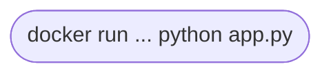
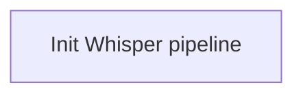
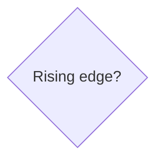
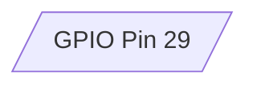
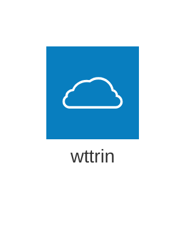

# Final: Design Again Checkpoint

Now that you have completed a few components, you probably need to iterate on your initial design!

## Deliverables

1. Update your initial design diagram.
2. Make a *detailed* flow diagram of the python script that is running in the Docker container on your Jetson.
3. Submit to Gradescope

### Software Flow Charts

Recall the following basic shapes for software flow charts:

**Oval** is the start or end

**Rectangle** is a process

**Diamond** is a decision

**Parallelogram** is input/output

There are many other symbols, for example **cloud** to represent a cloud hosted server.

